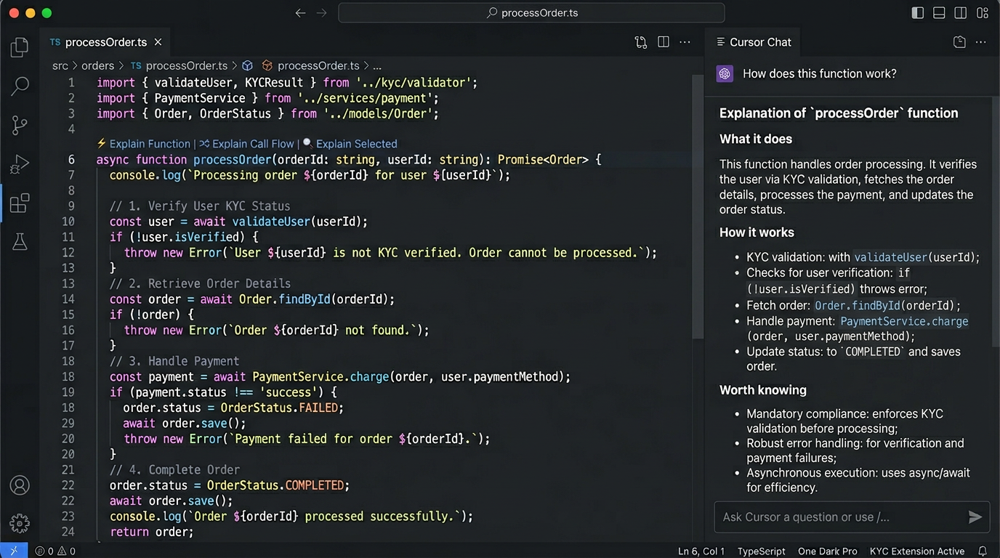
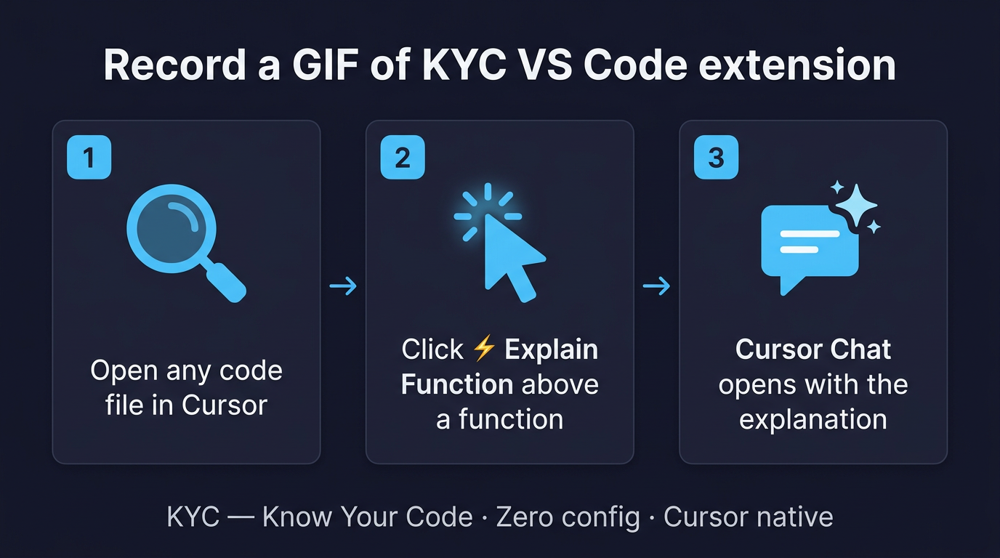

# KYC — Know Your Code

> **Zero-config AI code understanding, native to Cursor.**  
> Click a lens. Get the answer in Cursor Chat. No panel, no setup, no API key required.





---

## How it works

KYC adds three inline **code lens** actions above every function in your editor. Click one — KYC hands the right prompt off to **Cursor Chat** automatically, and Cursor's AI answers directly in the chat panel.

No sidebar. No custom panel. The explanation lives where you already work.

---

## The Three Skills

KYC ships with three purpose-built **Cursor Skills** — pre-loaded instructions that tell Cursor's AI exactly how to explain your code. Each skill is tuned for a different question.

### ⚡ Explain Function — `kyc-explain-function`

**When to use:** You want to understand what a function does.

The skill silently assesses the function's complexity — line count, branching depth, external calls — and adapts the output:

| Complexity | Output |
|------------|--------|
| **Simple** (< 15 lines, no deep branches) | 2–3 sentence plain prose. No headers, no lists. |
| **Medium** (15–50 lines or moderate branching) | Three short paragraphs: *What it does*, *How it works*, *Worth knowing*. |
| **Complex** (> 50 lines or heavy branching/external calls) | Full sectioned walkthrough with logical block breakdown and key logic paths. |

No Inputs/Outputs/Dependencies clutter. No parameter type lists. Just the explanation scaled to the function's actual complexity.

---

### 🔀 Explain Call Flow — `kyc-explain-callflow`

**When to use:** You want to understand what this function calls and why.

The skill runs a two-pass analysis:

1. **Silent classification** — every call in the function is classified as *signal* (real business logic delegation) or *noise* (getters, logging, stdlib formatting, fluent builders). Only signal calls are explained.
2. **Structured explanation** — each meaningful callee is explained: what it does, what data flows to/from it, and why it's called at that point.

If there are 3+ significant callees or conditional branching controls which callees are invoked, the skill draws a **Mermaid sequence diagram** automatically.

**What counts as signal:**
- Calls on services, repositories, clients, DAOs, managers, handlers
- External I/O: HTTP clients, DB drivers, message queues, cache clients
- Same-class business methods: `process*`, `save*`, `validate*`, `send*`, `fetch*`, etc.

**What gets filtered out:**
- `getX()`, `isX()`, `hasX()` on data objects
- `.toString()`, `.isEmpty()`, `.size()`, `.contains()`
- `log.*()`, `System.out.*()`, `console.log()`
- Math utilities, type conversions, simple string formatting

---

### 🔍 Explain Selected — `kyc-explain-selected`

**When to use:** You've highlighted a line or a block and want to understand it — especially if you're new to the language.

The explanation always has two sections:

**Section 1 — What this code does**  
Plain prose. What the selected code accomplishes and why it exists. No jargon, no type signatures.

**Section 2 — Language concepts used here**  
Non-trivial stdlib and language-specific calls explained in context: `map`, `filter`, `reduce`, `Optional.orElse()`, `CompletableFuture`, regex, date arithmetic, destructuring, null-coalescing operators, and more.

Trivial operations are always skipped (getters, basic arithmetic, logging, plain assignments). Concepts already explained earlier in the same chat are never repeated.

---

## Installation

### From the Marketplace

Search **"KYC Know Your Code"** in the Cursor/VS Code Extensions panel, or install directly:

```
ext install codevibeit.know-your-code
```

### Install the Cursor Skills

KYC works best with the three Cursor Skills installed. Run this in your terminal:

```bash
# Create the skills directory
mkdir -p ~/.cursor/skills/kyc-explain-function
mkdir -p ~/.cursor/skills/kyc-explain-callflow
mkdir -p ~/.cursor/skills/kyc-explain-selected
```

Then copy the three `SKILL.md` files from the [skills folder](https://github.com/imaresss/KnowYourCode/tree/main/skills) into the corresponding directories. Cursor will pick them up automatically — no restart required.

> **Note:** The skills are what make the explanations smart. Without them, KYC still sends the prompt to Cursor Chat, but Cursor won't have the tuned instructions for complexity-adaptive or noise-filtered output.

---

## Usage

### Code lens actions

Three actions appear above every function definition:

```
⚡ Explain Function  |  🔀 Explain Call Flow  |  🔍 Explain Selected
```

Click any of them. KYC assembles the right skill trigger and hands it to Cursor Chat.

### Keyboard shortcuts

| Action | Mac | Windows/Linux |
|--------|-----|---------------|
| Explain Function | `Cmd+Shift+E` | `Ctrl+Shift+E` |
| Explain Call Flow | `Cmd+Shift+F` | `Ctrl+Shift+F` |
| Show Context Actions | `Cmd+Shift+K` | `Ctrl+Shift+K` |

### Command palette

All commands are available via `Cmd+Shift+P` / `Ctrl+Shift+P`:

```
KYC: Explain Function
KYC: Explain Call Flow
KYC: Show Context Actions
```

---

## No API key required

When running in Cursor with `cursorHandoff` mode (the default), KYC routes everything through Cursor's built-in AI. You don't need to configure an OpenAI, Claude, or Gemini key — Cursor handles the model.

If you want to use KYC's standalone panel outside Cursor, you can configure a provider in Settings:

```
KYC: Set API Key      → configure OpenAI / Claude / Gemini
KYC: Switch Default AI Model
```

---

## Configuration

| Setting | Default | Description |
|---------|---------|-------------|
| `knowYourCode.cursorHandoff` | `true` | Route all commands to Cursor Chat instead of the built-in panel. |
| `knowYourCode.activeProvider` | — | Provider for standalone mode: `openai`, `claude`, `gemini`, `local`. |
| `knowYourCode.openai.apiKey` | — | OpenAI API key (standalone mode only). |
| `knowYourCode.claude.apiKey` | — | Anthropic API key (standalone mode only). |
| `knowYourCode.gemini.apiKey` | — | Gemini API key (standalone mode only). |
| `knowYourCode.cacheTtlSeconds` | — | Optional TTL for explanation cache entries. |

---

## Skill design principles

Each skill follows the same philosophy:

- **Silent pre-processing** — complexity rating, call classification, and deduplication checks happen without polluting the response.
- **Adaptive output** — the format matches the actual complexity of the code, not a fixed template.
- **Language-aware** — all three skills infer the programming language and adapt idiom explanations accordingly. Java verbosity is accounted for in complexity scoring.
- **No noise** — trivial getters, logging calls, basic arithmetic, and already-explained concepts are filtered before the response is written.

---

## Supported languages

KYC's skills work with any language Cursor supports. The call flow skill has specific noise-filter rules tuned for:

- TypeScript / JavaScript
- Java / Kotlin
- Python
- Go
- C / C++

Other languages benefit from the general signal/noise heuristics.

---

## Standalone features (non-Cursor mode)

When `cursorHandoff` is set to `false`, KYC displays explanations in its own webview panel with:

- **Smart caching** — explanations are stored in a local sql.js database, keyed by code content hash + model + provider. Repeated reads are instant.
- **Source navigation** — click inline code references in an explanation to jump to that line in the editor.
- **Tutorial links** — KYC detects built-in APIs and adds links to MDN, Java docs, Python docs, and other official references.
- **Text-to-Speech** — each explanation section has a speaker button for browser-native playback.
- **Incremental explain** — minor edits to a function trigger a diff-aware update rather than a full re-explanation.
- **Stop & Regenerate** — abort a running generation or retry with one click.

---

## Architecture

```
Editor (code lens click)
        │
        ▼
KYC Extension
  ├─ Resolves function / selection context via VS Code LSP
  ├─ Builds minimal skill trigger prompt
  └─ Hands off to Cursor Chat
        │
        ▼
Cursor Chat
  ├─ kyc-explain-function skill  →  complexity-adaptive explanation
  ├─ kyc-explain-callflow skill  →  noise-filtered call flow + sequence diagram
  └─ kyc-explain-selected skill  →  two-section language concept explanation
```

---

## Repository

```
src/
  extension.ts                  activation and command wiring
  commands/
    explainCurrentFunction.ts   Explain Function command
    explainCallFlow.ts          Explain Call Flow command
    runContextAction.ts         Explain Selected / context actions
  cursor/
    handoff.ts                  Cursor Chat handoff utility
    promptAssembler.ts          skill trigger prompt builder
  core/
    orchestrator.ts             cache-aware AI orchestration (standalone mode)
    config.ts                   settings loader
    types.ts                    shared domain types
  intelligence/
    symbolResolver.ts           symbol, caller, callee resolution
    diffAnalysis.ts             incremental explain diff engine
  providers/                    OpenAI / Claude / Gemini / local (standalone)
  ui/                           webview panel (standalone mode)
  cache/                        sql.js-backed explanation + tutorial cache
```

---

## Contributing

1. Clone the repo
2. `npm install`
3. `npm run build`
4. Press `F5` in Cursor/VS Code to open the Extension Development Host
5. Open any code file — the code lens actions appear above functions immediately

---

## License

MIT © [CodeVibe IT](https://github.com/imaresss/KnowYourCode)
