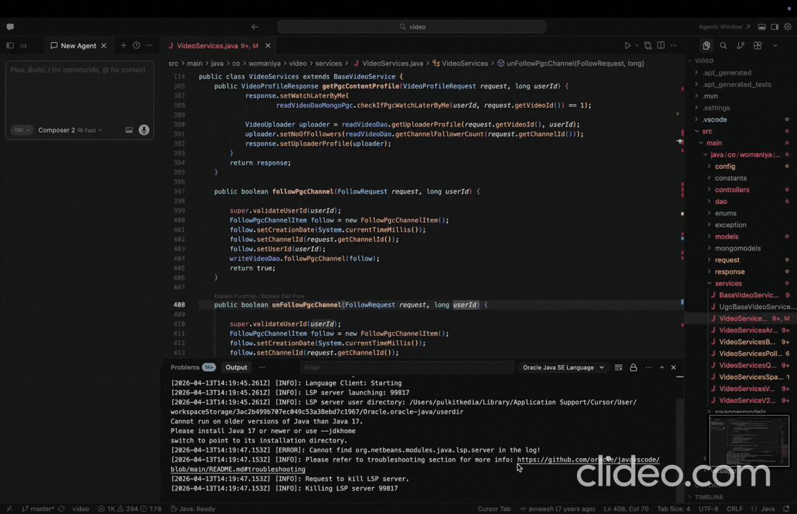

# KYC — Know Your Code

> **Understand unfamiliar code in one click, without leaving your editor.**  
> KYC helps you understand functions, call flows, selected code, and test coverage ideas instantly inside Cursor, Antigravity, and VS Code.

### See it in action



*Above: **Explain Function**, **Explain Call Flow**, **Explain Selected Code**, and **Suggest Tests** appear as code lens links above your code. Click one to open your editor's AI chat with a skill-tuned response.*

---

## Installation

### Install in Cursor (recommended)

KYC is available in **Cursor** from the Extensions marketplace, the same place you install other editor extensions.

1. Open **Cursor**.
2. Open the **Extensions** view: `Cmd+Shift+X` (macOS) or `Ctrl+Shift+X` (Windows/Linux), or click the Extensions icon in the activity bar.
3. In the search box, type **`codevibeit`** — that is the publisher ID. You should see **KYC — Know Your Code** (`codevibeit.know-your-code`).
4. Click **Install**.

You can also search by the display name **Know Your Code** or **KYC** if you prefer; using **`codevibeit`** is the quickest way to find this publisher’s listing.

**From the command palette:** `Extensions: Install Extensions…`, then search for `codevibeit`.

**From a terminal** (if you use the VS Code–compatible CLI that Cursor provides):

```bash
code --install-extension codevibeit.know-your-code
```

### Install in VS Code

The extension is also on the [Visual Studio Marketplace](https://marketplace.visualstudio.com/items?itemName=codevibeit.know-your-code). In VS Code, open Extensions and search for **`codevibeit`** or **KYC — Know Your Code**, or run:

```bash
code --install-extension codevibeit.know-your-code
```

### Install in Cursor, Antigravity, and VS Code

Install **KYC — Know Your Code** from IDE's extension marketplace. Search for **`codevibeit`** or **KYC — Know Your Code**.

### KYC Skills (automatic in Cursor, Antigravity, and VS Code)

The four KYC skills (`kyc-explain-function`, `kyc-explain-callflow`, `kyc-explain-selected`, `kyc-suggest-tests`) ship inside the extension. In **Cursor, Antigravity, and VS Code**, on first activation (and on every update), KYC copies them into `~/.cursor/skills/<skill-name>/SKILL.md`. You do **not** need to create folders or copy files by hand.

IDE loads skills from that directory automatically. If you edit a skill file locally, the next extension update may overwrite it with the bundled version — fork the skill in a new folder if you want a permanent custom copy.

> **Note:** The skills are what make the responses smart (complexity-aware function explain, noise-filtered call flow, deduplicated “selected code” help, and readable test plans). In other editors, KYC still works through chat handoff and standalone mode; the exact skill-loading behavior depends on the editor's AI environment.

---

## How it works

KYC adds inline **code lens** actions above every function in your editor. Click one — KYC hands the right prompt to the best available AI chat target in your environment (Cursor, Antigravity, or VS Code with an AI extension), and the answer appears directly in chat.

No sidebar. No custom panel. The explanation lives where you already work.

---

## The Four Skills

KYC ships with four purpose-built skills that tune how explanations and test suggestions are generated. Each skill is tuned for a different question.

### ⚡ Explain Function — `kyc-explain-function`

**When to use:** You want to understand what a function does.

The skill silently assesses the function's complexity — line count, branching depth, external calls — and adapts the output:

| Complexity | Output |
|------------|--------|
| **Simple** (< 15 lines, no deep branches) | 2–3 sentence plain prose. No headers, no lists. |
| **Medium** (15–50 lines or moderate branching) | Three short paragraphs: *What it does*, *How it works*, *Worth knowing*. |
| **Complex** (> 50 lines or heavy branching/external calls) | Full sectioned walkthrough with logical block breakdown and key logic paths. |

No Inputs/Outputs/Dependencies clutter. No parameter type lists. Just the explanation scaled to the function's actual complexity.

---

### 🔀 Explain Call Flow — `kyc-explain-callflow`

**When to use:** You want to understand what this function calls and why.

The skill runs a two-pass analysis:

1. **Silent classification** — every call in the function is classified as *signal* (real business logic delegation) or *noise* (getters, logging, stdlib formatting, fluent builders). Only signal calls are explained.
2. **Structured explanation** — each meaningful callee is explained: what it does, what data flows to/from it, and why it's called at that point.

If there are 3+ significant callees or conditional branching controls which callees are invoked, the skill draws a **Mermaid sequence diagram** automatically.

**What counts as signal:**
- Calls on services, repositories, clients, DAOs, managers, handlers
- External I/O: HTTP clients, DB drivers, message queues, cache clients
- Same-class business methods: `process*`, `save*`, `validate*`, `send*`, `fetch*`, etc.

**What gets filtered out:**
- `getX()`, `isX()`, `hasX()` on data objects
- `.toString()`, `.isEmpty()`, `.size()`, `.contains()`
- `log.*()`, `System.out.*()`, `console.log()`
- Math utilities, type conversions, simple string formatting

---

### 🔍 Explain Selected — `kyc-explain-selected`

**When to use:** You've highlighted a line or a block and want to understand it — especially if you're new to the language.

The explanation always has two sections:

**Section 1 — What this code does**  
Plain prose. What the selected code accomplishes and why it exists. No jargon, no type signatures.

**Section 2 — Language concepts used here**  
Non-trivial stdlib and language-specific calls explained in context: `map`, `filter`, `reduce`, `Optional.orElse()`, `CompletableFuture`, regex, date arithmetic, destructuring, null-coalescing operators, and more.

Trivial operations are always skipped (getters, basic arithmetic, logging, plain assignments). Concepts already explained earlier in the same chat are never repeated.

---

### 🧪 Suggest Tests — `kyc-suggest-tests`

**When to use:** You want a readable test plan for the current function before asking Cursor to write tests.

The skill silently analyzes:

- Branches and error paths
- External dependencies that need mocks or stubs
- Function shape, such as pure mapper, constructor, async workflow, or side-effecting service method
- The likely language and test framework from local file names, imports, annotations, and nearby test conventions

The output is a structured plan, not test code. It groups named cases into **Happy path**, **Edge & boundary**, **Error cases**, and **Mocking notes**, with each case showing:

- **When:** the condition being tested
- **Arrange:** what to set up
- **Assert:** what behavior to verify

It is language-aware for Java, Python, Go, TypeScript, JavaScript, Ruby, Rust, C, C++, and other common ecosystems. For example, it favors table-driven cases in Go, `Ok`/`Err` paths in Rust, pointer/bounds cases in C/C++, async resolution/rejection cases in JS/TS, and JUnit/Mockito-style dependency notes in Java.

---

## Usage

### Code lens actions

Above each function you’ll see muted inline links (VS Code **CodeLens**), for example:

```
Explain Function | Explain Call Flow | Suggest Tests
```

When you select a line or range, you may also see **Explain Selected Code** on that line.

Click any of them. KYC assembles the right skill trigger and hands it to the available AI chat integration.

### Keyboard shortcuts

| Action | Mac | Windows/Linux |
|--------|-----|---------------|
| Explain Function | `Cmd+Shift+E` | `Ctrl+Shift+E` |
| Explain Call Flow | `Cmd+Shift+D` | `Ctrl+Shift+D` |
| Show Context Actions | `Cmd+Shift+K` | `Ctrl+Shift+K` |

### Command palette

All commands are available via `Cmd+Shift+P` / `Ctrl+Shift+P`:

```
KYC: Explain Function
KYC: Explain Call Flow
KYC: Suggest Tests
KYC: Show Context Actions
```

---

## No API key required

When KYC detects any AI environment (AI IDE, AI assistant extension, or registered LM API model), it enables `cursorHandoff` automatically and routes commands to the best available chat panel.

This includes:
- Cursor with built-in AI chat
- Antigravity with AI chat support
- VS Code with one or more installed AI extensions like Claude, Trae, CodeX

If you want to use KYC's standalone panel outside Cursor, you can configure a provider in Settings:

```
KYC: Set API Key      → configure OpenAI / Claude / Gemini
KYC: Switch Default AI Model
```

---

## Configuration

| Setting | Default | Description |
|---------|---------|-------------|
| `knowYourCode.cursorHandoff` | `false` | AI chat handoff toggle. KYC auto-enables handoff whenever any AI IDE/assistant/extension capability is detected. Setting this to `true` force-enables handoff even when detection finds no AI. |
| `knowYourCode.activeProvider` | — | Provider for standalone mode: `openai`, `claude`, `gemini`, `local`. |
| `knowYourCode.openai.apiKey` | — | OpenAI API key (standalone mode only). |
| `knowYourCode.claude.apiKey` | — | Anthropic API key (standalone mode only). |
| `knowYourCode.gemini.apiKey` | — | Gemini API key (standalone mode only). |
| `knowYourCode.cacheTtlSeconds` | — | Optional TTL for explanation cache entries. |

---

## Skill design principles

Each skill follows the same philosophy:

- **Silent pre-processing** — complexity rating, call classification, and deduplication checks happen without polluting the response.
- **Adaptive output** — the format matches the actual complexity of the code, not a fixed template.
- **Language-aware** — all four skills infer the programming language and adapt idiom explanations or test-plan guidance accordingly. Java verbosity is accounted for in complexity scoring, and test suggestions adapt to common language/framework conventions.
- **No noise** — trivial getters, logging calls, basic arithmetic, and already-explained concepts are filtered before the response is written.

---

## Supported languages

KYC's skills work with any language supported by your editor + language server setup. The call flow and suggest-tests skills include language-aware heuristics tuned for:

- TypeScript / JavaScript
- Java / Kotlin
- Python
- Go
- C / C++
- Ruby
- Rust

Other languages benefit from the general signal/noise and test-planning heuristics.

---

## Standalone features (non-handoff mode)

When `cursorHandoff` is set to `false`, KYC displays explanations in its own webview panel with:

- **Smart caching** — explanations are stored in a local sql.js database, keyed by code content hash + model + provider. Repeated reads are instant.
- **Source navigation** — click inline code references in an explanation to jump to that line in the editor.
- **Tutorial links** — KYC detects built-in APIs and adds links to MDN, Java docs, Python docs, and other official references.
- **Text-to-Speech** — each explanation section has a speaker button for browser-native playback.
- **Incremental explain** — minor edits to a function trigger a diff-aware update rather than a full re-explanation.
- **Stop & Regenerate** — abort a running generation or retry with one click.

---

## Architecture

```
Editor (code lens click)
        │
        ▼
KYC Extension
  ├─ Resolves function / selection context via VS Code LSP
  ├─ Builds minimal skill trigger prompt
  └─ Hands off to available AI chat target
        │
        ▼
AI Chat Target (Cursor / Antigravity / VS Code AI extension)
  ├─ kyc-explain-function skill  →  complexity-adaptive explanation
  ├─ kyc-explain-callflow skill  →  noise-filtered call flow + sequence diagram
  ├─ kyc-explain-selected skill  →  two-section language concept explanation
  └─ kyc-suggest-tests skill     →  readable scenario-based test plan
```

---

## Repository

```
src/
  extension.ts                  activation and command wiring
  commands/
    explainCurrentFunction.ts   Explain Function command
    explainCallFlow.ts          Explain Call Flow command
    runContextAction.ts         Explain Selected / context actions
  cursor/
    handoff.ts                  Cursor Chat handoff utility
    promptAssembler.ts          skill trigger prompt builder
  core/
    orchestrator.ts             cache-aware AI orchestration (standalone mode)
    config.ts                   settings loader
    types.ts                    shared domain types
  intelligence/
    symbolResolver.ts           symbol, caller, callee resolution
    diffAnalysis.ts             incremental explain diff engine
  providers/                    OpenAI / Claude / Gemini / local (standalone)
  ui/                           webview panel (standalone mode)
  cache/                        sql.js-backed explanation + tutorial cache
```

---

## Contributing

1. Clone the repo
2. `npm install`
3. `npm run build`
4. Press `F5` in Cursor/VS Code to open the Extension Development Host
5. Open any code file — the code lens actions appear above functions immediately

---

## License

MIT © [CodeVibe IT](https://github.com/imaresss/KnowYourCode)
